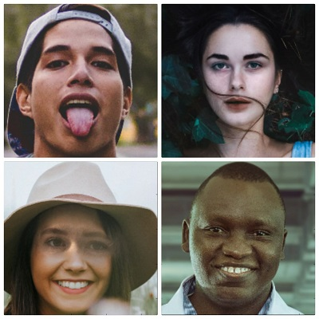
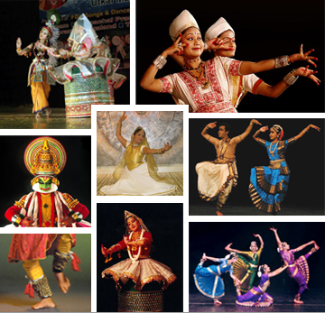

# Image-Classifiers

- This Repository includes Binary and Multi Class Image CLassifiers. All these classification task is done using 
  Keras library, so it can work as keras guide as well for those who wants to learn.

**What is an Image Classifier**

- An Image classifier classifies images into assigned categories. A process which humans does on a daily basis with ease but 
making a system which can succesfully classifies images into categories can be tricky.

- Image Classification is quite important practice for our machines to take further actions and if we wish to automate our 
daily tasks this small task need to be executed and executed well.

## Binary Image Classifiers:

- Classification in two categories.

### Real and Fake Face:

- Introduction:

A few months ago deep fakes are in news for creating nuisance. So I thought of it and tried to develop a model which will classify the Real and Fake faces present in test data provided.

- Things to look forward to:

 Pretrained Model Integration.
 Model Accuracy and Loss Visualization.
 Confusion Matrix.
 Predictions on few images.

- Also checkout the project to find out which of the faces above are real and which ones are fake.

[Real and Fake face Detection](https://www.kaggle.com/aditya48/real-and-fake-face-detection)

## MultiClass Image Classification:

- Classification into multiple Categories.

### Indian Dance Form Classification.

This notebook is my attempt of the Hackerearth deep learning contest of identifying Indian dance forms. All the credits of dataset goes to them. Although I have made some changes in the dataset. Originally there were 364 images for training data.

**************************************************************

- Official Details of the Contest:

[Hackerearth Deep Learning Challenge Identify Dance Form](https://www.hackerearth.com/challenges/competitive/hackerearth-deep-learning-challenge-identify-dance-form/)

- ABOUT CHALLENGE

- Problem statement

This International Dance Day, an event management company organized an evening of Indian classical dance performances to celebrate the rich, eloquent, and elegant art of dance. Post the event, the company planned to create a microsite to promote and raise awareness among the public about these dance forms. However, identifying them from images is a tough nut to crack.

The dataset consists of 364 images belonging to 8 categories, namely **manipuri, bharatanatyam, odissi, kathakali, kathak, sattriya, kuchipudi, and mohiniyattam.**

*****************************************************

**This Notebok will give you an enhanced view of transfer learning with multiple pretrained models for Multiclass Image Classification using Keras.**

Checkout the Kernel [Indian-Dance-Classification](https://www.kaggle.com/aditya48/indian-dance-classification).

